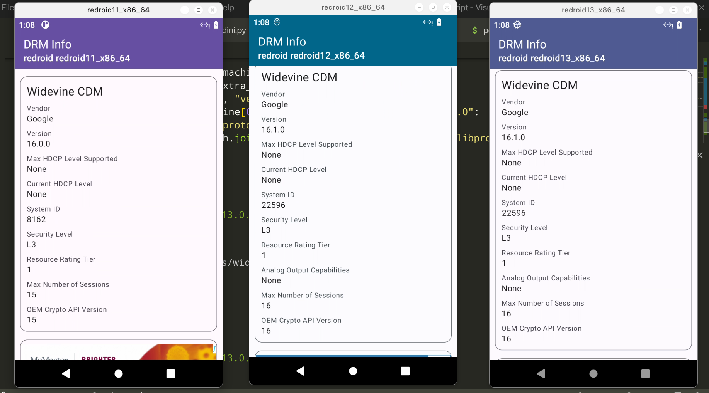

# Original author:

https://github.com/ayasa520/redroid-script

But it seems that the author is no longer maintaining it, and the pull request has not been responded. Some file addresses have become invalidm.I only changed the valid file download address, and did not change the other code

# You can use my images(arm64)

```bash
## install required kernel modules
apt install linux-modules-extra-`uname -r`
modprobe binder_linux devices="binder,hwbinder,vndbinder"
modprobe ashmem_linux
```

```bash
docker run -itd --restart=always --privileged \
  --name a11_1 \
  -v ~/redroid/redroid01/data:/data \
  -p 11101:5555 \
  abing7k/redroid:a11_magisk_arm \
  androidboot.redroid_gpu_mode=guest
```

# You can use my images(amd64)

```bash
## install required kernel modules
apt install linux-modules-extra-`uname -r`
modprobe binder_linux devices="binder,hwbinder,vndbinder"
modprobe ashmem_linux
```

**But the kernel modules failed after reboot in AMD. You can set a script to run these commands before booting up**

```bash
docker run -itd --restart=always --privileged \
  --name a11_01 \
  -v ~/redroid/redroid01/data:/data \
  -p 11101:5555 \
  abing7k/redroid:a11_magisk_ndk_amd \
  androidboot.redroid_gpu_mode=auto \
  ro.product.cpu.abilist0=x86_64,arm64-v8a,x86,armeabi-v7a,armeabi \
  ro.product.cpu.abilist64=x86_64,arm64-v8a \
  ro.product.cpu.abilist32=x86,armeabi-v7a,armeabi \
  ro.dalvik.vm.isa.arm=x86 \
  ro.dalvik.vm.isa.arm64=x86_64 \
  ro.enable.native.bridge.exec=1 \
  ro.dalvik.vm.native.bridge=libndk_translation.so \
  ro.ndk_translation.version=0.2.2
```


It has 6 tags

1. abing7k/redroid:a11_magisk_arm
2. abing7k/redroid:a11_gapps_arm
3. abing7k/redroid:a11_gapps_magisk_arm
4. abing7k/redroid:a11_arm
5. abing7k/redroid:a11_magisk_ndk_amd
6. abing7k/redroid:a11_ndk_amd


If you want connect to this android.You can run scrcpy-web

```bash
docker run --rm -itd --privileged --name scrcpy-web -p 8000:8000/tcp emptysuns/scrcpy-web:v0.1

docker exec -it scrcpy-web adb connect your_ip:11101
```

Open your browser,and open your_ip:48000. Click on the H264 Converter


Pull up from the bottom of the screen


# If you want your own image

## Remote-Android Script

This script adds Gapps, Magisk and libndk to redroid **without recompiling the entire image**
If redroid-script doesn't work, please create an issue

## Dependencies

- lzip

## Specify container type

Specify container type. Default is docker

option:

```
 -c {docker,podman}, --container {docker,podman}
```


## Specify an Android version

Use `-a` or `--android-version` to specify the Android version of the image being pulled. The value can be `8.1.0`, `9.0.0`, `10.0.0`, `11.0.0`, `12.0.0`, `12.0.0_64only` or `13.0.0`. The default is 11.0.0.

```bash
# pull the latest image
python redroid.py -a 11.0.0
```

## Add OpenGapps to ReDroid image


```bash
python redroid.py -g
```

## Add libndk arm translation to ReDroid image


libndk_translation from guybrush firmware.

libndk seems to have better performance than libhoudini on AMD.

```bash
python redroid.py -n
```

## Add Magisk to ReDroid image


Zygisk and modules like LSPosed should work.


```bash
python redroid.py -m
```

## Add widevine DRM(L3) to ReDroid image



```
python redroid.py -w
```


## Example

This command will add Gapps, Magisk, Libndk, Widevine to the ReDroid image at the same time.

```bash
python redroid.py -a 11.0.0 -gmnw
```

Then start the docker container.

```bash
docker run -itd --restart=always --privileged \
  --name a11_1 \
  -v ~/redroid/redroid01/data:/data \
  -p 11101:5555 \
  redroid/redroid:a11_magisk_arm \
  androidboot.redroid_gpu_mode=guest
```


## Troubleshooting

- Magisk installed: N/A

  According to some feedback from WayDroid users, changing the kernel may solve this issue. https://t.me/WayDroid/126202

- The device isn't Play Protect certified

  1. Run below command on host

  ```bash
  adb root
  adb shell settings get secure android_id
  ```

  

  2. Grab device id and register on this website: https://www.google.com/android/uncertified/

- libndk doesn't work

  I only made it work on `redroid/redroid:11.0.0`. Also, turning on Zygisk seems to break libndk for 32 bit apps, but arm64 apps still work.

- libhoudini doesn't work

  I have no idea. I can't get any version of libhoudini to work on redroid.

- If you want to install APK, you can use the adb install command.

  

  


## Credits

1. [remote-android](https://github.com/remote-android)
2. [waydroid_script](https://github.com/casualsnek/waydroid_script)
3. [Magisk Delta](https://huskydg.github.io/magisk-files/)
4. [vendor_intel_proprietary_houdini](https://github.com/supremegamers/vendor_intel_proprietary_houdini)
